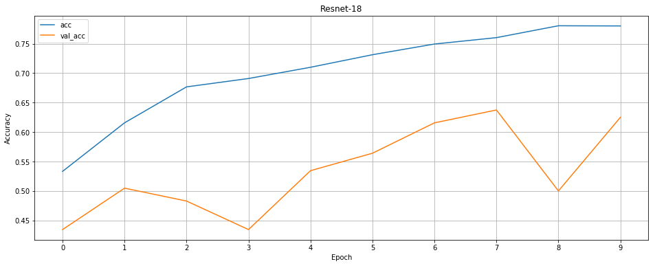

# ResNet - Residual Network

Based on [Deep Residual Learning for Image Recognition](https://arxiv.org/pdf/1512.03385.pdf) by Kaiming He et al, 2015
with _pre-activation_ improvements from [Identity Mappings in Deep Residual Networks](https://arxiv.org/pdf/1603.05027.pdf).

Differences in implementation from original paper:
- model is trained on flowers dataset ([download](http://download.tensorflow.org/example_images/flower_photos.tgz))
- due to smaller input image size, first layer has filter size [3x3] and there is no maxpool layer following it
- there is only bottleneck residual block implemented
- layers that downsample use bottleneck layers to adjust skip-connection size
- only implemented resnet-18 (`conf/resnet_18.json`) but other networks can be easily implemented

> Other ResNet architectures can be easily added by editing json files in `conf` directory

Sample training - takes ~11mins on MacBook Pro 2015

